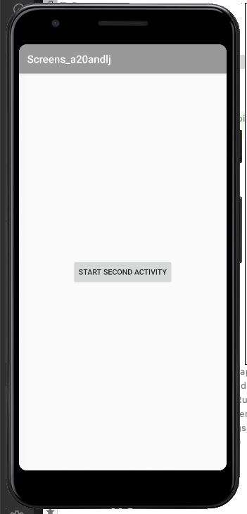

# Rapport Dugga 4: Screens

För att starta upp dugga 4 forkades och klonades appen screens från LenSys och lades i den egna repositoryn.
Därefter skulle det läggas till en ny aktivitet till projektet. Den skapades i Android Studio med hjälp av att
högerklicka på java-mappen, välja new/activity/empty activity. Då skapades en ny java-fil och en 
ny xml-fil som fick namnen enligt figur 1.
 
figur 1.

För att kunna starta den andra aktiviteten skapades en kanpp i xml-filen activity_main i en constraintlayout.
Den placerades i mitten med de olika constraintreglerna.
```
<Button
        android:id="@+id/start_second_activity"
        android:layout_width="wrap_content"
        android:layout_height="wrap_content"
        android:text="Start second activity"
```
För att knappen ska kunna öppna den andra aktiviteten deklarerades den i onCreate-scopet och tilldelades
att hittas med findViewById. Därefter gjordes det möjligt att den ska lyssna efter klick. 
För att den ska kunna öppna den andra aktiviteten skapades en intent eller syfte där det deklarerades att
om ett klick görs så öppnas den andra aktiviteten som i koden nedan. Med putExtra lades ett för- och efternamn
som hänvisar till två stycken textvyer som skapats i andra aktivitetenj xml-fil. De ska alltså dyka upp i andra vyn.
Längst ner i metoden startas intentet.
```
        Button button = findViewById(R.id.start_second_activity);
        button.setOnClickListener(new View.OnClickListener() {
            @Override
            public void onClick(View view) {
            Intent intent = new Intent(MainActivity.this, SecondActivity.class);
            intent.putExtra("name", "Andreas");
            intent.putExtra("surname", "Ljung");
            startActivity(intent);
            }
        });
```
Sedan skulle ett fragment läggas till i den andra aktiviteten och på samma sätt som en andra aktivitet 
skapades så högerklickades det på Java-mappen, men istället valdes ett tomt fragment för aktivitet.
I fragmentet lades det till en imageview där och en "oerhört vacker" png-bild laddades upp till drawable-mappen.
Med src länkades det till bilden. 
```
<ImageView
        android:id="@+id/bild_andreas"
        android:layout_width="match_parent"
        android:layout_height="match_parent"
        android:contentDescription="Bild Andreas"
        android:src="@drawable/andreas_bild"
        />
```
I den andra aktivitetens xml-fil så lades en fragmentvy till som kopplades till fragmentet. Den fick en
vidd och en höjd för att bestämma hur stor del den skulle ta av vyn i den andra vyn.
```
<fragment
        android:name="com.example.screens.BlankFragment"
        android:layout_width="167dp"
        android:layout_height="260dp"
```
Sedan stylades den andra vyn med lite olika constraints för att placeras intill varandra, inte helt lätt att förstå
i början men med lite olika test fram och tillbaka hamnade de olika vyerna efter önskemål.
I values-mappen ändrades de olika färgerna bara för att testa och öva lite. 
I den andra vyns java-fil lades det också till en button som gör att det går att komma tillbaka till 
MainActivity-vyn igen. Det gjordes på samma sätt som den första knappen men med close istället enligt nedan.
```
Button close = findViewById(R.id.close_second_activity);
        close.setOnClickListener(new View.OnClickListener() {
            @Override
            public void onClick(View view) {
                finish();
            }
        });
```
Slutresultatet visas här med två screenshots av emulatorn.

 
 


